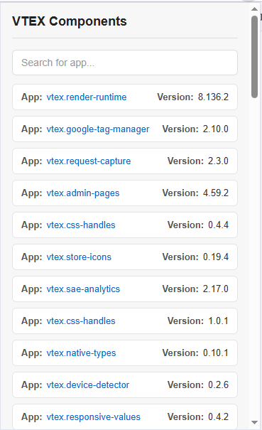
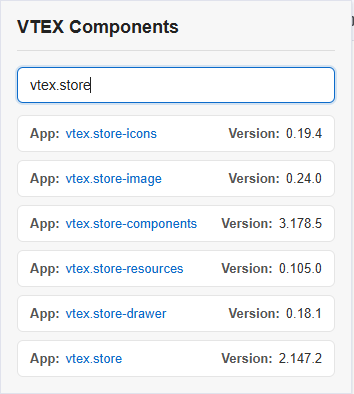

# VTEX Inspector

A Chrome extension for VTEX developers that provides quick access to useful runtime information from any VTEX store.




## ✨ Features

### Runtime
- Account
- Workspace
- Current page
- Route
- Platform
- Runtime version
- Culture
- Binding information
- Device information
- Loaded pages

### Apps
- Lists all apps loaded on the current page
- Displays each app version
- Real-time search
- Fast and lightweight interface

### OrderForm
- Displays the current OrderForm
- Automatically updates when the OrderForm changes

---

## 📦 Installation

### Option 1 — Download the pre-built extension (Recommended)

The repository already includes the compiled extension inside the `dist` folder.

1. Clone or download this repository.

```bash
git clone https://github.com/Everton-Afonso/vtex-inspector-v2.git
```

2. Open Chrome.

3. Go to:

```
chrome://extensions
```

4. Enable **Developer mode**.

5. Click **Load unpacked**.

6. Select the **dist** folder.

The extension is ready to use.

> Every release includes an updated `dist` folder, so you don't need to build the project unless you want to modify the source code.

---

### Option 2 — Build from source

Clone the repository:

```bash
git clone https://github.com/Everton-Afonso/vtex-inspector-v2.git
```

Install the dependencies:

```bash
yarn
```

Generate the production build:

```bash
yarn build
```

After the build finishes, a new **dist** folder will be generated.

Open:

```
chrome://extensions
```

Enable **Developer mode**.

Click **Load unpacked** and select the generated **dist** folder.

---

## 🚀 Development

Build the content scripts while watching for changes:

```bash
yarn dev
```

Whenever the files inside `dist` change, simply click **Reload** on the extension in `chrome://extensions`.

---

## 💻 Usage

1. Open any VTEX store.
2. Click the extension icon.
3. Navigate between the available tabs:
   - Runtime
   - Apps
   - OrderForm
4. Use the search box to quickly find a specific app.

---

## 🔍 Search

The Apps tab includes a real-time search.

Examples:

- `store-components`
- `slider`
- `product-summary`
- `search-result`

---

## 🛠️ Technologies

- React
- TypeScript
- Vite
- Chrome Extension API (Manifest V3)

---

## 📂 Project Structure

```text
.
├── public/
│   ├── icons/
│   │   ├── icon16.png
│   │   ├── icon48.png
│   │   └── icon128.png
│   ├── img/
│   │   ├── components.png
│   │   └── search-for-app.png
│   ├── manifest.json
│   └── page-script.js
│
├── src/
│   ├── content/
│   │   ├── components.ts
│   │   ├── content.ts
│   │   ├── inject.ts
│   │   ├── message-handler.ts
│   │   ├── orderform.ts
│   │   ├── orderformCache.ts
│   │   ├── orderformListener.ts
│   │   ├── runtime.ts
│   │   └── runtimeInfos.ts
│   │
│   ├── popup/
│   │   ├── components/
│   │   │   ├── ComponentsList/
│   │   │   │   ├── ComponentsList.tsx
│   │   │   │   └── styles.css
│   │   │   ├── OrderForm/
│   │   │   │   ├── OrderForm.tsx
│   │   │   │   └── styles.css
│   │   │   ├── Runtime/
│   │   │   │   ├── Runtime.tsx
│   │   │   │   └── styles.css
│   │   │   └── Tabs/
│   │   │       ├── Tabs.tsx
│   │   │       └── styles.css
│   │   │
│   │   ├── hooks/
│   │   │   ├── useComponents.ts
│   │   │   ├── useOrderForm.ts
│   │   │   └── useRuntime.ts
│   │   │
│   │   ├── services/
│   │   │   └── chrome.ts
│   │   │
│   │   ├── index.tsx
│   │   └── styles.css
│   │
│   ├── styles/
│   │   └── globals.css
│   │
│   ├── types/
│   │   ├── components.ts
│   │   ├── orderform.ts
│   │   ├── runtime.ts
│   │   └── Tabs.ts
│   │
│   ├── App.tsx
│   └── main.tsx
│
└── index.html
```

---

## 🌐 Browser Compatibility

- Google Chrome
- Microsoft Edge
- Brave
- Opera
- Any Chromium-based browser

---

## 🤝 Contributing

Contributions are always welcome.

If you find a bug or have an idea for a new feature, feel free to open an Issue or submit a Pull Request.

---

## 📄 License

This project is licensed under the MIT License.