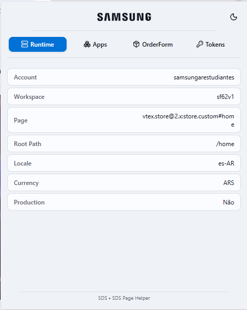
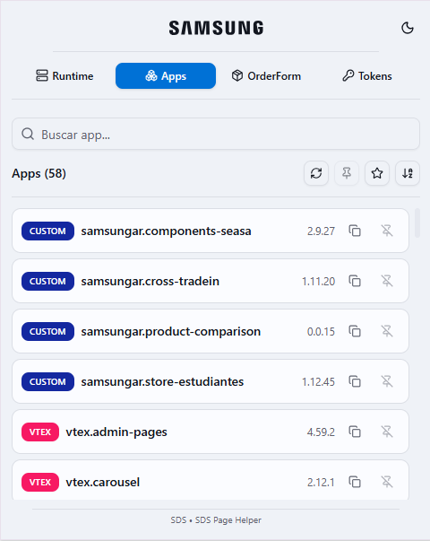
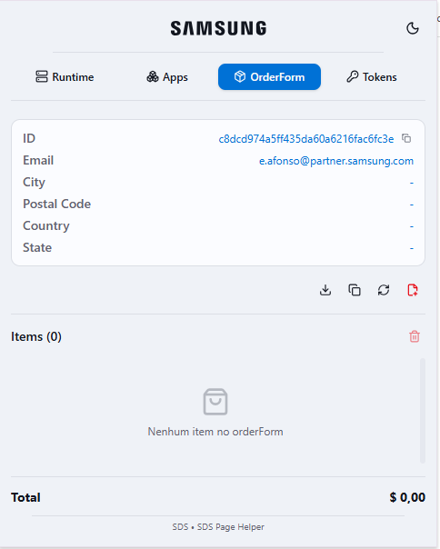
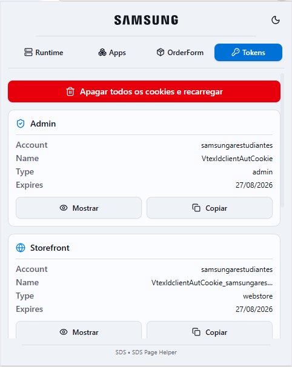

# SDS Page Helper

A Chrome extension for VTEX developers that provides quick access to useful runtime information and store data from any VTEX page.






## Features

### Runtime
Displays runtime information from the current VTEX page:

- **Account** — VTEX account name
- **Workspace** — Active workspace
- **Page** — Current page type (e.g., `store.home`, `store.product`)
- **Root Path** — Route root path
- **Locale** — Culture/language
- **Currency** — Configured currency
- **Production** — Whether the environment is production

### Apps
Lists all apps/components loaded on the current page:

- Full list of apps with name, version, and type (VTEX or CUSTOM)
- **Real-time search** by app name
- **Alphabetical sorting** (A-Z / Z-A)
- **Custom apps filter** — highlights non-VTEX apps, including Samsung (blue badge)
- **Pinned apps filter** — view only pinned apps
- **Pin/unpin apps** — persisted in localStorage
- **Copy** app identifier (`app@version`) to clipboard
- **Refresh** app list
- Color-coded badges: pink for VTEX, blue for Samsung/custom

### OrderForm
Complete OrderForm (shopping cart) management:

- Display **OrderForm ID** with copy button
- Customer data: **Email, City, Zip Code, Country, State**
- Display applied **discount coupon** (if any)
- **Copy JSON** — full OrderForm to clipboard
- **Download JSON** — OrderForm as file
- **Refresh** OrderForm data
- **Generate new OrderForm** — clears and creates a new one
- **Items list** with image, name, skuId, productId
- **Copy** skuId and productId individually
- **Adjust quantity** (+/-)
- **Remove** individual items
- **Clear all** items
- **Totalizers** expandable section: Subtotal, Shipping, Discounts, Tax, etc.
- Price formatted with `Intl.NumberFormat`

### Tokens
Authentication token management:

- List VTEX tokens found in cookies (`VtexIdclientAutCookie`, `vtex_session`)
- Decode JWT to display: **Account, Name, Type (Admin/Storefront/Session), Expiration date**
- **Show/Hide** full token
- **Copy** full token to clipboard
- **Delete all cookies** and reload page (destructive action)

### Additional Features
- **Automatic VTEX detection** — checks via `__RUNTIME__`, cookies, scripts, meta tags, URL
- **Light/Dark theme** — toggle with localStorage persistence, respects OS preference
- **Persisted active tab** — selected tab remembered between sessions
- **Loading states** — skeleton placeholders during data loading
- **Strategic fallbacks** — multiple paths to obtain data (content script, chrome.scripting, direct fetch)

---

## Installation

### Option 1 — Download the pre-built extension (Recommended)

The repository already includes the compiled extension inside the `dist` folder.

1. Clone or download this repository.

```bash
git clone https://github.com/Everton-Afonso/vtex-inspector-v2.git
```

2. Open Chrome and go to:

```
chrome://extensions
```

3. Enable **Developer mode**.

4. Click **Load unpacked**.

5. Select the **dist** folder.

The extension is ready to use.

> Every release includes an updated `dist` folder, so you don't need to build the project unless you want to modify the source code.

### Option 2 — Build from source

Clone the repository:

```bash
git clone https://github.com/Everton-Afonso/vtex-inspector-v2.git
```

Install the dependencies:

```bash
yarn
```

Generate the production build:

```bash
yarn build
```

After the build finishes, a new **dist** folder will be generated.

Open:

```
chrome://extensions
```

Enable **Developer mode**, click **Load unpacked** and select the generated **dist** folder.

---

## Development

Build the content scripts while watching for changes:

```bash
yarn dev
```

Whenever the files inside `dist` change, simply click **Reload** on the extension in `chrome://extensions`.

---

## Usage

1. Open any VTEX store.
2. Click the extension icon.
3. Navigate between the available tabs:
   - Runtime
   - Apps
   - OrderForm
   - Tokens
4. Use the search box to quickly find a specific app.

---

## Technologies

| Layer | Technology |
|---|---|
| Frontend | React 19, TypeScript |
| Build | Vite 8 |
| UI | Tailwind CSS 4, shadcn/ui, Lucide React |
| Extension | Chrome Extension API (Manifest V3), @crxjs/vite-plugin |
| Package Manager | Yarn |

---

## Project Structure

```text
.
├── public/
│   ├── icons/
│   │   ├── icon16.png
│   │   ├── icon48.png
│   │   └── icon128.png
│   ├── img/
│   │   ├── Apps.png
│   │   ├── OrderForm.png
│   │   ├── Runtime.png
│   │   └── Tokens.png
│   ├── manifest.json
│   └── page-script.js
│
├── src/
│   ├── components/
│   │   └── ui/              # shadcn/ui components
│   │
│   ├── content/
│   │   ├── content-isolated.ts
│   │   ├── inject.ts
│   │   ├── message-handler.ts
│   │   ├── detectVtex.ts
│   │   ├── runtime.ts
│   │   ├── runtimeInfos.ts
│   │   ├── components.ts
│   │   ├── orderform.ts
│   │   ├── orderformCache.ts
│   │   └── orderformListener.ts
│   │
│   ├── hooks/
│   │   ├── useActiveTab.ts
│   │   ├── useComponents.ts
│   │   ├── useCopyClipboard.ts
│   │   ├── useOrderForm.ts
│   │   ├── usePinnedApps.ts
│   │   ├── useRuntime.ts
│   │   ├── useTheme.ts
│   │   └── useVtexStore.ts
│   │
│   ├── popup/
│   │   ├── index.tsx
│   │   └── components/
│   │       ├── Logo.tsx
│   │       ├── Runtime/Runtime.tsx
│   │       ├── ComponentsList/ComponentsList.tsx
│   │       ├── OrderForm/OrderForm.tsx
│   │       └── Tokens/Tokens.tsx
│   │
│   ├── services/
│   │   ├── chrome.ts
│   │   ├── getCookies.ts
│   │   ├── removeAllCookies.ts
│   │   ├── runtime-scripting.ts
│   │   └── orderform-fallback.ts
│   │
│   ├── types/
│   │   ├── global.d.ts
│   │   ├── runtime.ts
│   │   ├── components.ts
│   │   ├── orderform.ts
│   │   └── Tab.ts
│   │
│   ├── App.tsx
│   └── main.tsx
│
└── index.html
```

---

## Browser Compatibility

- Google Chrome
- Microsoft Edge
- Brave
- Opera
- Any Chromium-based browser

---

## Contributing

Contributions are always welcome.

If you find a bug or have an idea for a new feature, feel free to open an Issue or submit a Pull Request.

---

## License

This project is licensed under the MIT License.
